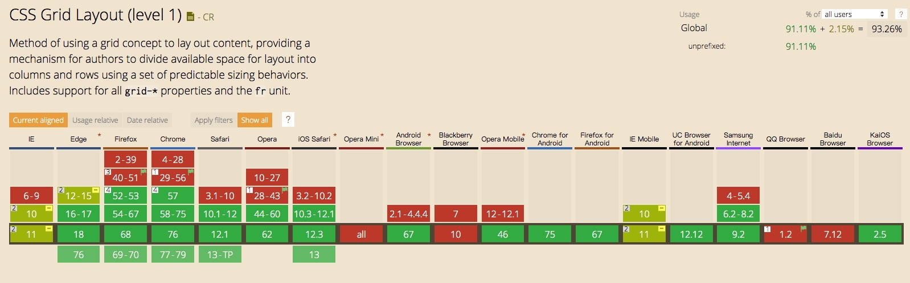

# Grid了解一波:eyes:

## 一. 概述

网格布局（Grid）是非常强大的 CSS 布局方案，它将网页划分成一个个网格，可以任意组合不同的网格，做出各种各样的布局。以前只能通过复杂的 CSS 框架达到的效果，现在浏览器内置了。

Grid 布局与 Flex 布局有一定的相似性，都可以指定容器内部多个项目的位置。但是，它们也存在重大区别：Flex 布局是轴线布局，只能指定"项目"针对轴线的位置，可以看作是一维布局。Grid 布局则是将容器划分成"行"和"列"，产生单元格，然后指定"项目所在"的单元格，可以看作是二维布局。Grid 布局远比 Flex 布局强大。

## 二. 基本概念
在学习网格布局之前，有必要搞明白一些基本概念：
### 1. 容器和项目
采用网格布局的区域，称为"容器"（container）。容器内部采用网格定位的子元素，称为"项目"（item）。
```html
<div>
  <div><p>1</p></div>
  <div><p>2</p></div>
  <div><p>3</p></div>
</div>
```
上面代码中，最外层的`<div>`元素就是容器，内层的三个`<div>`元素就是项目。

注意：只有容器的顶层子元素才是项目，项目的子元素并不是，比如上面代码的`<p>`元素就不是项目。Grid 布局只对项目生效。

### 2. 行和列

容器里面的水平区域称为"行"（row），垂直区域称为"列"（column）。

### 3. 单元格

行和列的交叉区域，称为"单元格"（cell）。正常情况下，n行和m列会产生n x m个单元格。比如，3行3列会产生9个单元格。

### 4.网格线

划分网格的线，称为"网格线"（grid line）。水平网格线划分出行，垂直网格线划分出列。正常情况下，n行有n + 1根水平网格线，m列有m + 1根垂直网格线，比如三行就有四根水平网格线。

|  |  |  |  |  |
| --- | --- | --- | --- | --- |
|  |  |  |  |  |
|  |  |  |  |  |
|  |  |  |  |  |

上述即一个4行*5列的图例，包含20个单元格，水平网格线有5条，垂直网格线有6条

## 三. 容器属性

Grid 布局的属性分成两类。一类定义在容器上面，称为容器属性；另一类定义在项目上面，称为项目属性。首先介绍容器属性

### 1. `display`

通过`display: grid`指定一个容器采用网格布局。`display: inline-grid`指定容器是一个行内元素，且内部采用网格布局，二者的区别类似于`block`和`inline-block`。

[display示例](https://codepen.io/LazyChen/pen/pMRWbO)

注意，设为网格布局以后，容器子元素（项目）的`float`、`display: inline-block`、`display: table-cell`、`vertical-align`和`column-*`等设置都将失效。

### 2. `grid-template-columns` / `grid-template-rows`

容器指定了网格布局以后，接着就要划分行和列。`grid-template-columns`属性定义每一列的列宽，`grid-template-rows`属性定义每一行的行高。

```css
.container {
  display: grid;
  grid-template-columns: 100px 100px 100px;
  grid-template-rows: 100px 100px 100px;
}
```
上述定义了一个三行三列的网格，且列宽和行高都是`100px`

同样，也可以使用百分比：
```css
.container {
  display: grid;
  grid-template-columns: 33.33% 33.33% 33.33%;
  grid-template-rows: 33.33% 33.33% 33.33%;
}
```

#### (1). repeat()
`repeat()`用于解决当网格很多且一样时需要写很多遍重复值的问题，上面的例子用`repeat`简化就是：
```css
.container {
  display: grid;
  grid-template-columns: repeat(3, 33.33%);
  grid-template-rows: repeat(3, 33.33%);
}
```
`repeat()`接受两个参数，第一个参数是重复的次数（上例是`3`），第二个参数是所要重复的值, 或者是要重复的模式。

`grid-template-columns: repeat(2, 20px 40px 60px);`即重复模式，定义了6列，第一列和第四列的宽度为`20px`，第二列和第五列为`40px`，第三列和第六列为`60px`。[repeat示例](https://codepen.io/LazyChen/pen/pMRWbO)

#### (2). auto-fill
有时，单元格的大小是固定的，但是容器的大小不确定。如果希望每一行（或每一列）容纳尽可能多的单元格，这时可以使用`auto-fill`关键字表示自动填充。
```css
.container {
  display: grid;
  grid-template-columns: repeat(auto-fill, 100px);
}
```
上面代码表示每列宽度100px，然后自动填充，直到容器不能放置更多的列。[auto-fill示例](https://codepen.io/LazyChen/pen/pMRWbO)

#### (3). fr
为了方便表示比例关系，网格布局提供了`fr`关键字（fraction 的缩写，意为"片段"）。比如两列的宽度分别为`1fr`和`2fr`，就表示后者是前者的两倍。
```css
.container {
  display: grid;
  grid-template-columns: 1fr 2fr 3fr;
}
```
上述指定了三列的比例分别为1:2:3，[fr示例一](https://codepen.io/LazyChen/pen/pMRWbO)

`fr`如果与绝对长度的单位结合使用，会非常方便地实现定宽与自适应填充。
```css
.container {
  display: grid;
  grid-template-columns: 150px 1fr 1fr;
}
```
上述指定了第一列为定宽`150px`，剩下两列相同，平分剩下的容器。[fr示例二](https://codepen.io/LazyChen/pen/pMRWbO)
#### (4). minmax()
`minmax()`函数产生一个长度范围，表示长度就在这个范围之中。它接受两个参数，分别为最小值和最大值。

比如：`grid-template-columns: 1fr 1fr minmax(100px, 1fr);`

其中`minmax(100px, 1fr)`表示列宽不小于100px，不大于1fr。[minman示例](https://codepen.io/LazyChen/pen/pMRWbO)

#### (5). auto
`auto`关键字表示由浏览器自己决定长度。

`grid-template-columns: 100px auto 100px;`

上面代码中，第二列的宽度，基本上等于该列单元格的最大宽度，除非单元格内容设置了`min-width`，且这个值大于最大宽度。

#### (6). 网格线名称
`grid-template-columns`属性和`grid-template-rows`属性里面，还可以使用方括号，指定每一根网格线的名字，方便以后的引用。

```css
.container {
  display: grid;
  grid-template-columns: [c1] 100px [c2] 100px [c3] auto [c4];
  grid-template-rows: [r1] 100px [r2] 100px [r3] auto [r4];
}
```
上面代码指定网格布局为3行 x 3列，因此有4根垂直网格线和4根水平网格线。方括号里面依次是这八根线的名字。

#### (7). 应用实例
`grid-template-columns`属性对于网页布局非常有用。两栏式布局只需要一行代码。
```css
.wrapper {
  display: grid;
  grid-template-columns: 70% 30%;
}
```
上面代码将左边栏设为70%，右边栏设为30%。

传统的十二网格布局，写起来也很容易: `grid-template-columns: repeat(12, 1fr);`

### 3.row-gap,column-gap,gap
`row-gap`属性设置行与行的间隔（行间距），`column-gap`属性设置列与列的间隔（列间距）。`gap`属性是`column-gap`和`row-gap`的合并简写形式，语法如下:

 `grid-gap: <grid-row-gap> <grid-column-gap>;`
```css
row-gap: 20px;
column-gap: 20px;
/* 上下两种写法是一样的 */
gap: 20px 20px; 
```
如果`gap`省略了第二个值，浏览器认为第二个值等于第一个值。
### 4.grid-template-areas
网格布局允许指定"区域"（area），一个区域由单个或多个单元格组成。grid-template-areas属性用于定义区域。
```css
.container {
  display: grid;
  grid-template-columns: 100px 100px 100px;
  grid-template-rows: 100px 100px 100px;
  grid-template-areas: 'a b c'
                       'd e f'
                       'g h i';
}
```
上面代码先划分出9个单元格，然后将其定名为a到i的九个区域，分别对应这九个单元格。

多个单元格合并成一个区域的写法如下。
```css
grid-template-areas: 'a a a'
                     'b b b'
                     'c c c';
```
上面代码将9个单元格分成a、b、c三个区域。

下面是一个布局实例。
```css
grid-template-areas: "header header header"
                     "main main sidebar"
                     "footer footer footer";
```
上面代码中，顶部是页眉区域header，底部是页脚区域footer，中间部分则为main和sidebar。

如果某些区域不需要指定成区域，则使用"点"（`.`）表示。
```css
grid-template-areas: 'a . c'
                     'd . f'
                     'g . i';
```
上面代码中，中间一列为点，表示没有用到该单元格，或者该单元格不属于任何区域。

注意，区域的命名会影响到网格线。每个区域的起始网格线，会自动命名为`区域名-start`，终止网格线自动命名为`区域名-end`。比如，区域名为header，则起始位置的水平网格线和垂直网格线叫做`header-start`，终止位置的水平网格线和垂直网格线叫做`header-end`。

### 5.grid-auto-flow
划分网格以后，容器的子元素会按照顺序，自动放置在每一个网格。默认的放置顺序是`row`， 即"先行后列"，即先填满第一行，再开始放入第二行，以此类推。也可以将它设成`column`，变成"先列后行"。

`grid-auto-flow`属性除了设置成`row`和`column`，还可以设成`row dense`和`column dense`。dense翻译过来稠密的意思，这两个值主要用于，某些项目指定位置以后，剩下的项目怎么自动放置, 是否稠密放置，具体不好描述，请看[grid-auto-flow示例](https://codepen.io/LazyChen/pen/pMRWbO)。

### 6.justify-content，align-content，place-content
三者是用来设置单元格内容整体在容器里的位置的, `justify-content`属性是整个内容区域在容器里面的水平位置（左中右），`align-content`属性是整个内容区域的垂直位置（上中下）。
```css
.container {
  justify-content: start | end | center | stretch | space-around | space-between | space-evenly;
  align-content: start | end | center | stretch | space-around | space-between | space-evenly;  
}
/* space-evenly - 项目与项目的间隔相等，项目与容器边框之间也是同样长度的间隔。 */
```
`place-content`属性是`align-content`属性和`justify-content`属性的合并简写形式：`place-content: <align-content> <justify-content>`，如果省略第二个值，浏览器就会假定第二个值等于第一个值。

### 7.justify-items，align-items，place-items
三者是用来设置单元格的内容的位置的, `justify-items`属性设置单元格内容的水平位置（左中右），`align-items`属性设置单元格内容的垂直位置（上中下），默认值是`stretch`，拉伸撑满整个单元格。
```css
.container {
  justify-items: start | end | center | stretch;
  align-items: start | end | center | stretch;
}
```
`place-items`属性是`align-items`属性和`justify-items`属性的合并简写形式, 如果省略第二个值，则浏览器认为与第一个值相等。

`place-items: <align-items> <justify-items>;`

### 8.grid-auto-columns，grid-auto-rows
有时候，一些项目的指定位置，在现有网格的外部。比如网格只有3列，但是某一个项目指定在第5行。这时，浏览器会自动生成多余的网格，以便放置项目。

`grid-auto-columns`属性和`grid-auto-rows`属性用来设置浏览器自动创建的多余网格的列宽和行高。它们的写法与`grid-template-columns`和`grid-template-rows`完全相同。如果不指定这两个属性，浏览器完全根据单元格内容的大小，决定新增网格的列宽和行高。

### 9.grid-template，grid
`grid-template`属性是`grid-template-columns`、`grid-template-rows`和`grid-template-areas`这三个属性的合并简写形式。

`grid`属性是`grid-template-rows`、`grid-template-columns`、`grid-template-areas`、 `grid-auto-rows`、`grid-auto-columns`、`grid-auto-flow`这六个属性的合并简写形式。

不过从易读易写的角度考虑，还是建议不要合并属性。

## 四. 项目属性
### 1.grid-column-start，grid-column-end，grid-row-start，grid-row-end
项目的位置是可以指定的，具体方法就是指定项目的四个边框，分别定位在哪根网格线。
* grid-column-start属性：左边框所在的垂直网格线
* grid-column-end属性：右边框所在的垂直网格线
* grid-row-start属性：上边框所在的水平网格线
* grid-row-end属性：下边框所在的水平网格线
```css
.item-1 {
  grid-column-start: 2;
  grid-column-end: 4;
}
```
比如上述代码指定，1号项目的左边框是第二根垂直网格线，右边框是第四根垂直网格线。

再来看一个[示例](https://codepen.io/LazyChen/pen/pMRWbO)，指定了四个边框位置的效果。：
```css
.item-1 {
  grid-column-start: 1;
  grid-column-end: 3;
  grid-row-start: 2;
  grid-row-end: 4;
}
```
指定网格线除了使用网格线数字编号，还可以使用网格线的名字（前提是之前指定了网格线名字）。

除了网格线，这四个属性的值还可以使用`span`关键字，表示"跨越"，即左右边框（上下边框）之间跨越多少个网格， 上面的示例改成如下效果是一样的：
```css
.item-1 {
  grid-column-start: 1;
  grid-column-end: span 2;
  grid-row-start: 2;
  grid-row-end: span 2;
}
```
使用这四个属性，如果产生了项目的重叠，可以使用`z-index`属性指定项目的重叠顺序。

### 2.grid-column，grid-row
`grid-column`属性是`grid-column-start`和`grid-column-end`的合并简写形式，`grid-row`属性是`grid-row-start`属性和`grid-row-end`的合并简写形式。

上一个示例中代码可以简写为如下：
```css
.item {
  grid-column: 1 / 3;
  grid-row: 2 / span 2;
}
```
斜杠以及后面的部分可以省略，默认跨越一个网格。

### 3.grid-area
`grid-area`属性指定项目放在哪一个区域。通过`grid-template-areas`定义好容器区域名，然后再指定项目对应的区域：
```css
.container {
  grid-template-areas: 'a b c' 'd e f' 'h i j';
}
.item-1 {
  grid-area: e;
}
```
上述效果见[grid-area示例](https://codepen.io/LazyChen/pen/pMRWbO)。

`grid-area`属性还可用作`grid-row-start`、`grid-column-start`、`grid-row-end`、`grid-column-end`的合并简写形式，直接指定项目的位置。语法如下：

`grid-area: <row-start> / <column-start> / <row-end> / <column-end>;`

上个示例的例子可以合并为如下：
```css
.item-1 {
  grid-area: 2 / 1 / span 2 / 3;
}
```
### 4.justify-self，align-self，place-self 
`justify-self`属性设置单元格内容的水平位置（左中右），跟`justify-items`属性的用法完全一致，但只作用于单个项目。

`align-self`属性设置单元格内容的垂直位置（上中下），跟`align-items`属性的用法完全一致，也是只作用于单个项目。

这两个属性都可以取下面四个值。
```css
.item {
  justify-self: start | end | center | stretch;
  align-self: start | end | center | stretch;
}
/* 
start：对齐单元格的起始边缘。
end：对齐单元格的结束边缘。
center：单元格内部居中。
stretch：拉伸，占满单元格的整个宽度（默认值）。
*/
```
`place-self`属性是`align-self`属性和`justify-self`属性的合并简写形式, 语法如下： `place-self: <align-self> <justify-self>;`, 如果省略第二个值，会m默认认为这两个值相等。

## 五. 结语

### 兼容性



可以看到在pc端对grid的支持已经比较好了，IE也实现了大部分的支持。在移动端的使用的话需要慎重考虑，比如手机端QQ和百度浏览器目前都是不支持的（截止2019/08/01），详见[caniuse](https://caniuse.com/#search=grid)

### 使用场景

说到布局，不得不提flex, flex在响应式布局中是很关键的，它是内容驱动型的布局。不需要预先知道会有什么内容，可以设定元素如何分配剩余的空间以及在空间不足的时候如何表现。显得较为强大的是一维布局的能力，而grid优势则在于二维布局, 这也是他们设计的初衷。

并不存在最好的布局方式。Flexbox 和 Grid 是两种不同的布局形式，我们应该根据具体的场景将它们搭配使用，而不是相互替代。

最后是一些通过实例比较的场景总结，但并不一定时时适用，还是那句话，需要结合实际具体场景：

> 1. Grid适用于布局大画面, grid使得页面的布局相对容易，甚至可以处理一些不规则和非对称的设计。
> 2. Flexbox 非常适合解决元素内的内容水平垂直对齐等问题, 可以使用 Flex 来定位设计上一些较小的细节。
> 3. 二维布局适合使用 grid（行与列）。
> 4. Flexbox 适用于单一维度的布局（行或列）。

#### 参考引用
[阮一峰网格布局教程](http://www.ruanyifeng.com/blog/2019/03/grid-layout-tutorial.html)

[A Complete Guide to Grid](https://css-tricks.com/snippets/css/complete-guide-grid/)

[to Grid or to flex](https://juejin.im/post/5c7ce781e51d4514913c5bc4)

[flex](https://mp.weixin.qq.com/s?__biz=MzIzMzQzMjg3Ng==&mid=2247484165&idx=1&sn=bfd3c98f53d2e9141a461a69576016e2&chksm=e884f146dff37850f0e75b11777d4752e1370468de68aa5b9a053a97194bb5299844a610c111&scene=21#wechat_redirect)
